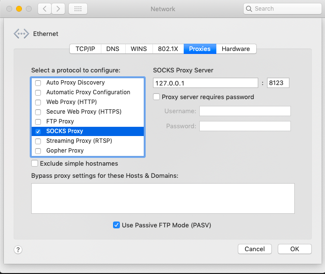
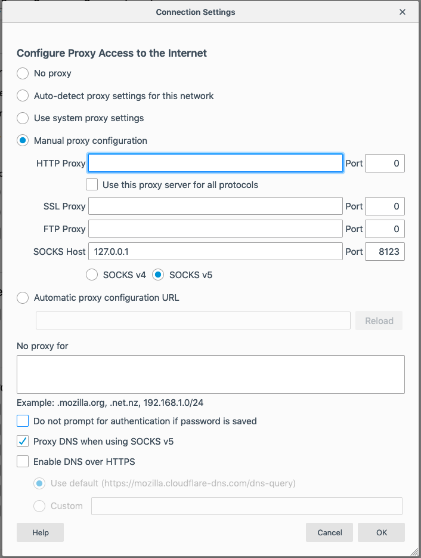

# Proxy via SSH Tunnel
O
nce you have a direct SSH connection to juno, you proxy into it, allowing you access into the MSK network remotely (alternatively, you can use the VPN)

There are two steps, first you must open the tunnel:
```
ssh -D [port number between 1000 to 64000] -f -C -q -N juno
```
Check that it actually works:

```
momac35:~ dalai$ ps auxw | grep ssh
dalai             1103   0.0  0.0  4334872   2656   ??  Ss   11:44AM   0:04.26 ssh -D 8123 -f -C -q -N juno
dalai             1102   0.0  0.1  4364688  20064 s000  S    11:44AM   0:01.79 ssh -q -x xbio -W juno:22
dalai             1098   0.0  0.0  4289368   5212   ??  S    11:43AM   0:00.01 /usr/bin/ssh-agent -l
dalai             1725   0.0  0.0  4286488    844 s000  S+    3:06PM   0:00.00 grep ssh
```
System-wide proxy connection (tested on a Mac)
On a Mac, edit your Network Settings:

```Ethernet > Advanced > Proxies```

Enable SOCKS Proxy, enter 127.0.01 : [port number between 1000 to 64000 you tunneled to]

Remove any Bypass proxy settings



Confirm with OK

Hit Apply

If you're using Chrome, System changes should automatically apply to the browser

If you're using Firefox, you need to edit Network Settings to "Use system proxy settings"

Test here: https://whatismyipaddress.com/

**Browser-specific proxy connection (Firefox speciality, tested on a Mac):**

If you dislike the idea to forcing your entire system onto the proxy, Firefox allows you to proxy.

```Firefox > Preferences > Network Settings > Settings...```

```Enable 'Manual proxy configuation'```

Set your SOCKS host to
```
127.0.0.1, Port [port number between 1000 to 64000 you tunneled to]
```
Enable SOCKS v5

Enable Proxy DNS when using SOCKS v5

Clear any "No proxy for" text box



Test here: https://whatismyipaddress.com/

NOTE: If you don't set the Proxy DNS with SOCKS v5, you won't able to access MSK internal sites even though your IP has changed.

**Undoing the proxy:**

For Mac, disable the SOCK proxy

For Firefox, switch back to No proxy

You may also collapse the tunnel by identifying the process ID (pid) and killing it

```
momac35:~ dalai$ ps auxw | grep ssh
dalai             1103   0.0  0.0  4334872   2656   ??  Ss   11:44AM   0:04.26 ssh -D 8123 -f -C -q -N juno
dalai             1102   0.0  0.1  4364688  20064 s000  S    11:44AM   0:01.79 ssh -q -x xbio -W juno:22
dalai             1098   0.0  0.0  4289368   5212   ??  S    11:43AM   0:00.01 /usr/bin/ssh-agent -l
dalai             1725   0.0  0.0  4286488    844 s000  S+    3:06PM   0:00.00 grep ssh
```
The second column is the pid if using ps with auxw

```kill 1103```

Always confirm the kill:

```
momac35:~ dalai$ ps auxw | grep ssh
dalai             1098   0.0  0.0  4289368   5212   ??  S    11:43AM   0:00.01 /usr/bin/ssh-agent -l
dalai             1780   0.0  0.0  4279320    852 s000  S+    3:28PM   0:00.00 grep ssh
```